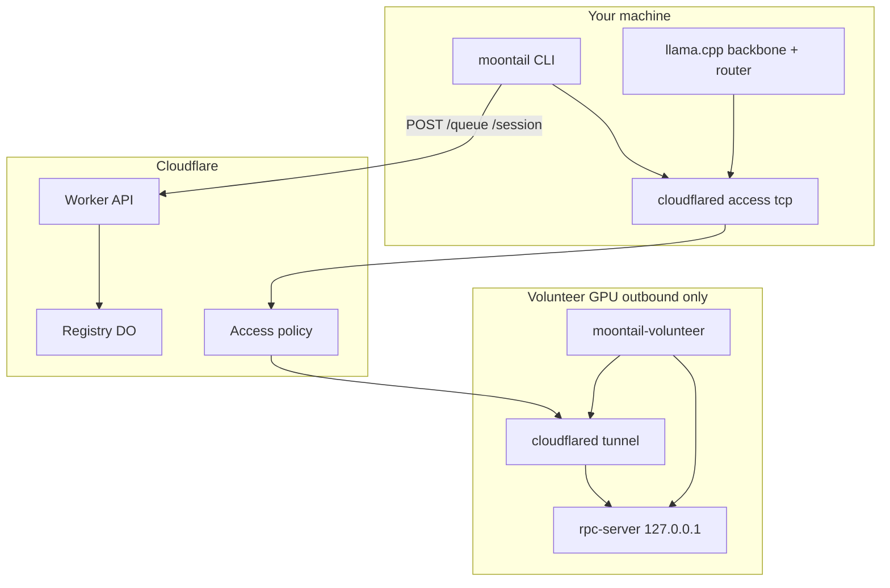

<p align="center">
  
</p>

<p align="center">
  <em>tail the moon, split the experts</em><br/>
  <strong>Volunteer your GPU. Queue for Kimi K2.</strong><br/>
  Reciprocal MoE inference — home GPUs, frontier model, zero central GPU.<br/>
  <strong>Research preview</strong> — ~800 lines of glue around llama.cpp + Cloudflare.
</p>

<p align="center">
  <a href="LICENSE"></a>
  <a href="docs/SECURITY.md"></a>
  <a href="docs/BENCHMARKS.md"></a>
  
</p>

---

## Join the swarm (volunteers + prompters)

**You cannot prompt until you volunteer.** Run `init` on a machine with a GPU, join the waiting room, then use `prompt` from that same machine (or any machine using your saved `~/.moontail/config`).

### What you need before `init`

| Requirement | Notes |
|-------------|--------|
| **A running MoonTail server** | URL from whoever hosts the Worker — see [Host the server](#host-the-server-operator) below if that's you |
| **NVIDIA (or compatible) GPU + drivers** | Enough VRAM for Kimi K2 (or a community Q4 split GGUF) |
| **K2 weights** | Community split GGUF **or** `bash scripts/pull-k2.sh` with `HF_TOKEN` |
| **cloudflared tunnel** | Outbound tunnel from your machine; hostname set in `MOONTAIL_TUNNEL_HOST` |
| **Accept GPU lending terms** | `--accept-terms` — read [docs/VOLUNTEER_TERMS.md](docs/VOLUNTEER_TERMS.md) |

### Step 1 — Install (every device)

```bash
curl -fsSL https://raw.githubusercontent.com/rockybalboan19/MoonTail/main/install.sh | bash
export PATH="$HOME/.moontail/bin:$PATH"
```

Needs: `git`, `gcc`, `curl`, `cmake` (for llama.cpp), `cloudflared`, `python3` (optional, for HF pull).

### Step 2 — Point at the swarm

Replace with your operator's Worker URL and **your** tunnel hostname:

```bash
export MOONTAIL_WORKER=https://moontail.YOUR-SUBDOMAIN.workers.dev
export MOONTAIL_TUNNEL_HOST=volunteer-YOURNAME.example.com
```

Optional — stream-convert K2 from Hugging Face (slow; needs license acceptance on HF):

```bash
export HF_TOKEN=hf_...
```

Or put a community GGUF path in `~/.moontail/config` after first init (`model=/path/to/K2-00001-of-....gguf`).

### Step 3 — Join (volunteer your GPU)

```bash
moontail init --accept-terms
```

This will:

1. Generate a **peer_id** + **peer_token** (saved in `~/.moontail/config`)
2. Start **moontail-volunteer** (`rpc-server` on **127.0.0.1 only** + your cloudflared tunnel)
3. **Register** with the swarm and show the waiting room

You should see either:

- `Waiting for N more user(s) to run moontail init` — need more volunteers (`MIN_VOLUNTEERS`, default **3**)
- `Swarm ready` — pool is big enough to run prompts

Check anytime:

```bash
moontail status
```

**Repeat Step 2–3 on other machines** (different GPUs, different `MOONTAIL_TUNNEL_HOST` each). Each device is one swarm member.

### Step 4 — Prompt (after you joined + swarm is ready)

Only works if **you already ran `init --accept-terms`** on this machine (config has `peer_id` + `peer_token`):

```bash
export MOONTAIL_WORKER=https://moontail.YOUR-SUBDOMAIN.workers.dev
moontail prompt "Hello Kimi K2"
```

FIFO queue → when a slot opens → session → llama-cli runs K2 with expert offload via the swarm.

---

## Host the server (operator)

The **server** is a **Cloudflare Worker + Durable Object** — no GPU, no model weights. It only pairs volunteers, holds the queue, and issues tunnel credentials for sessions.

### 1. Cloudflare account

- [Cloudflare Workers](https://developers.cloudflare.com/workers/) enabled on your account
- [Wrangler CLI](https://developers.cloudflare.com/workers/wrangler/install-and-update/) logged in:

```bash
npm install -g wrangler
wrangler login
```

### 2. Deploy the control plane

```bash
git clone https://github.com/rockybalboan19/MoonTail.git
cd MoonTail/server/control-plane
npm install
npx wrangler deploy
```

Note the URL printed, e.g. `https://moontail.<your-subdomain>.workers.dev`. **Share this as `MOONTAIL_WORKER`.**

Tune the swarm in [`wrangler.toml`](server/control-plane/wrangler.toml):

| Variable | Default | Meaning |
|----------|---------|---------|
| `MIN_VOLUNTEERS` | `3` | Waiting room until this many peers registered |
| `MAX_CONCURRENT_PROMPTS` | `3` | Max prompts running at once |
| `PEER_STALE_SEC` | `120` | Drop volunteers with no heartbeat |

For a small test, set `MIN_VOLUNTEERS = "1"` and redeploy.

### 3. Cloudflare Access secrets (required for prompts)

Without these, `/session` returns **503** — volunteers can register and `status` works, but **no one can prompt**.

1. **Zero Trust** → [Access → Service Auth → Service Tokens](https://one.dash.cloudflare.com/) → **Create token**
2. Copy **Client ID** and **Client Secret**
3. Attach to the Worker:

```bash
cd server/control-plane
npx wrangler secret put CF_ACCESS_CLIENT_ID
npx wrangler secret put CF_ACCESS_CLIENT_SECRET
```

4. Create an **Access application** for each volunteer tunnel hostname (e.g. `volunteer-1.example.com`). Policy: **deny by default**, allow only that **service token**. Template: [`config/cloudflare-access-policy.example.json`](config/cloudflare-access-policy.example.json)

### 4. Volunteer tunnels (per GPU machine)

Each volunteer runs **cloudflared** outbound — not a port you open on your router.

```bash
cloudflared tunnel create moontail-vol-1
# Edit config/cloudflared-volunteer.yml → tunnel id, credentials, hostname
cloudflared tunnel route dns moontail-vol-1 volunteer-1.example.com
```

Volunteer sets `MOONTAIL_TUNNEL_HOST=volunteer-1.example.com` before `moontail init --accept-terms`.

### 5. Local dev server (optional)

```bash
cd server/control-plane
# Create .dev.vars (gitignored) with CF_ACCESS_CLIENT_ID and CF_ACCESS_CLIENT_SECRET
npm run dev
# → http://127.0.0.1:8787  use as MOONTAIL_WORKER for local testing
```

### 6. Verify

```bash
curl -sf https://moontail.YOUR-SUBDOMAIN.workers.dev/status | python3 -m json.tool
```

Expect `volunteer_pool_size`, `waiting_for`, `swarm_ready`.

Full operator checklist: [docs/KIMI_K2_LAUNCH.md](docs/KIMI_K2_LAUNCH.md)

---

## The deal (one paragraph)

**MoonTail** splits Kimi K2-Instruct across home GPUs: your machine runs attention/router locally; routed expert FFN runs on another volunteer via llama.cpp `-ot` + ggml-rpc over an authenticated Cloudflare tunnel. **Reciprocity:** donate GPU time with `init --accept-terms`, then get queue access with `prompt`. Research preview — ggml-rpc is upstream PoC; see [docs/SECURITY.md](docs/SECURITY.md).

---

## Architecture



---

## CLI reference

| Command | Who | What |
|---------|-----|------|
| `moontail init --accept-terms` | **Everyone first** | Volunteer GPU + join swarm |
| `moontail status` | Everyone | Pool size / waiting room / queue |
| `moontail prompt "…"` | Registered volunteers only | FIFO queued K2 inference |

Dev only: `--skip-tunnel` with `MOONTAIL_WORKER=http://127.0.0.1:8787`.

---

## Security (infra only)

| Layer | Protects |
|-------|----------|
| **127.0.0.1 rpc-server** | No public ggml-rpc bind |
| **Cloudflare Access** | Sessions fail closed without operator secrets |
| **peer_token** | Register / queue / release auth |
| **Rate limits** | Register / queue / session spam |

[docs/SECURITY.md](docs/SECURITY.md) · [docs/VOLUNTEER_TERMS.md](docs/VOLUNTEER_TERMS.md)

---

## Weights

Full K2 GGUF is **~500GB+** class at Q4. Fastest path: a community **split GGUF** (point `model=` at part 1 in `~/.moontail/config`). Slow path: `bash scripts/pull-k2.sh` with `HF_TOKEN`.

Uses upstream [llama.cpp](https://github.com/ggml-org/llama.cpp) `master` (`deepseek2`).

---

## Contributing

```bash
bash scripts/check-loc.sh
bash scripts/check-security.sh
```

Developers: [docs/DEVELOPER.md](docs/DEVELOPER.md) · Gates: [docs/BENCHMARKS.md](docs/BENCHMARKS.md)

---

## License

MIT — see [LICENSE](LICENSE).
