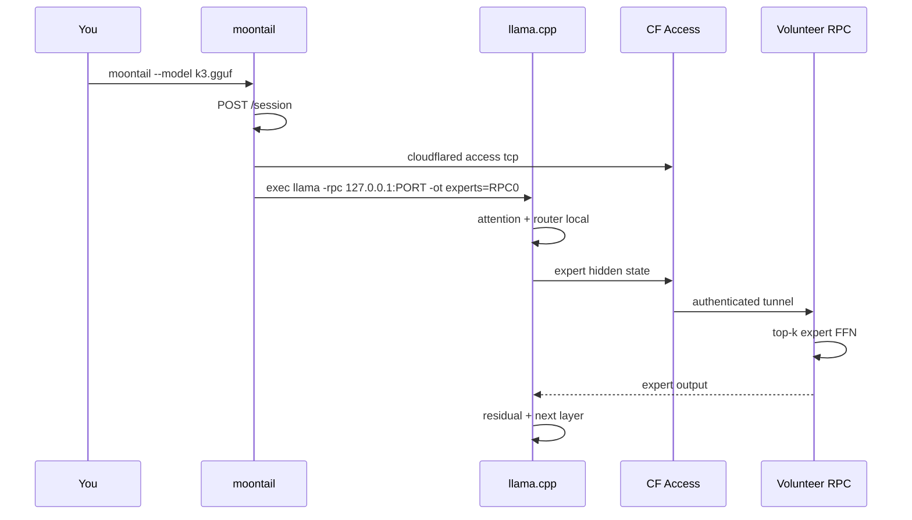

<table>
<tr>
<td valign="middle"></td>
<td valign="middle">
<h1>MoonTail</h1>
<p><em>tail the moon, split the experts</em></p>
<p><strong>The CLI for reciprocal MoE inference.</strong><br/>
Run frontier-scale models on your machine. Offload expert compute to a volunteer swarm.<br/>
Zero central GPU. Measurement-first. ~800 lines of glue.</p>
</td>
</tr>
</table>

<p align="center">
  <a href="LICENSE"></a>
  <a href="docs/SECURITY.md"></a>
  <a href="docs/BENCHMARKS.md"></a>
  
</p>

---

## What is MoonTail?

**MoonTail** is the user-facing CLI for the **Reciprocal MoE Swarm** — a zero-cost architecture where:

- **Your machine** runs the *backbone*: attention, routing, shared experts, speculative verify (via [llama.cpp](https://github.com/ggml-org/llama.cpp))
- **Volunteer GPUs** run *routed expert FFN* shards over an authenticated tunnel
- **Cloudflare** handles session pairing and access — never your tensor data

MoonTail is the thin layer that turns *“I want to generate tokens”* into *“open a session, spawn the tunnel, launch llama with the right `-rpc` and `-ot` flags.”*

<p align="center">
   &nbsp;
  <code>moontail --model k3.gguf</code> → session ✓ tunnel ✓ llama ✓
</p>

> Spawn it once. You'll know.

---

## Why it exists

| Problem | MoonTail's answer |
|--------|-------------------|
| 2.8T MoE won't fit on one GPU | Expert tensors go to RPC volunteers; backbone stays local |
| Can't trust random RPC on the internet | ggml-rpc binds **127.0.0.1 only**; Cloudflare Tunnel + Access is the real API |
| Don't rewrite inference | llama.cpp + `-ot` tensor overrides — no custom MoE engine |
| Don't promise fake tok/s | Six measurement **gates** before scheduler code ships |

---

## Architecture


### Data flow (one token, one MoE layer)



---

## Quick start

### 1. Build MoonTail

```bash
git clone https://github.com/ysharmcode/MoonTail.git
cd MoonTail
git submodule update --init --recursive

make                    # → build/moontail, build/moontail-volunteer
# or: cmake -B build && cmake --build build
```

### 2. Build llama.cpp with RPC

```bash
cmake -B vendor/llama.cpp/build -DGGML_RPC=ON
cmake --build vendor/llama.cpp/build --config Release
```

### 3. Run the control plane (local dev)

```bash
cd server/control-plane && npm install && npm run dev
# → http://127.0.0.1:8787
```

### 4. Start a volunteer

```bash
./build/moontail-volunteer --worker http://127.0.0.1:8787
```

### 5. Generate

```bash
./build/moontail --model path/to/model.gguf
```

You'll see the pixel comet. Then tokens.

**Local dev (no tunnel):**

```bash
./build/moontail --skip-tunnel --model model.gguf   # only with --worker on localhost
```

---

## CLI reference

Running `moontail --help` prints a pixel comet (warm core, tapering cyan tail).

```
Usage: moontail [options] -- [llama-cli args...]

  --worker URL       Control plane (default http://127.0.0.1:8787)
  --model PATH       GGUF checkpoint
  --llama PATH       llama-cli binary
  --skip-tunnel      Dev only — localhost worker required
  --quiet, -q        Skip startup banner
  -h, --help         Show help (banner included)
```

---

## Security model

MoonTail treats **ggml-rpc as localhost-only compute**, not a public API. Upstream llama.cpp [explicitly warns](https://github.com/ggml-org/llama.cpp/tree/master/tools/rpc) against exposing rpc-server to untrusted networks (CVE-2026-34159 class).

| Layer | What it protects |
|-------|------------------|
| **Cloudflare Tunnel + Access** | Unauthenticated internet → volunteer |
| **Version pin ≥ b8492** | Authenticated requester → volunteer RCE class |
| **`--skip-tunnel` guard** | Accidental prod bypass — refused unless worker is localhost |
| **One session per volunteer** | Upstream single-client rpc-server model |

Full policy: [docs/SECURITY.md](docs/SECURITY.md)

---

## Measurement gates (v17)

We don't ship scheduler fantasies. We ship numbers.

| Gate | What it measures |
|------|------------------|
| **1** | Local backbone ms/round |
| **2** | Speculative acceptance rate |
| **3** | Dependency graph (K3 Block AttnRes vs proxy config) |
| **4** | Expert RPC latency (localhost) |
| **5** | Concurrent streams vs **volunteer pairing ceiling** |
| **6** | Auth tunnel success (Tunnel+Access only) |

```bash
python tools/gate3_depgraph.py
MODEL=model.gguf bash tools/gate1_backbone.sh
```

Details: [docs/BENCHMARKS.md](docs/BENCHMARKS.md)

---

## Repository map

```
MoonTail/
├── client/
│   ├── moontail.c       ← you are here
│   ├── moon.h           ← pixel comet startup banner
│   └── protocol.h
├── server/
│   ├── volunteer.c      → moontail-volunteer binary
│   └── control-plane/   → Cloudflare Worker + Registry DO
├── tools/gate*.sh       → measurement gates
├── config/              → tensor overrides, tunnel templates
└── vendor/llama.cpp     → inference engine (submodule)
```

---

## Performance honesty

```
tok/s ≈ (accepted_tokens_per_round × 1000) / (backbone_ms + expert_rpc_ms + rtt_ms)
```

MoonTail does **not** promise 8–10 tok/s. It promises to **measure** the four numbers that decide whether that's possible. Conservative baseline until gates pass: **~1–4 tok/s**.

---

## Contributing

1. `bash scripts/check-loc.sh` — stay under 2.8k LOC custom code  
2. `bash scripts/check-security.sh` — localhost rpc, skip-tunnel guards  
3. Run gates before claiming perf improvements  

---

## License

MIT — see [LICENSE](LICENSE).

---

<p align="center">

<br/>
<em>MoonTail — tail the moon, split the experts</em>
</p>
