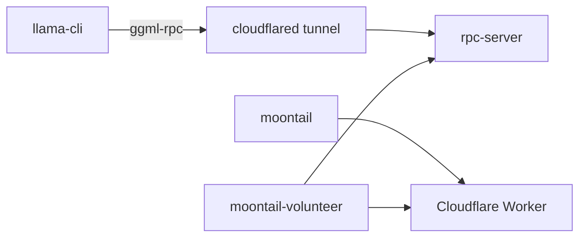

<p align="center">
  
</p>

<h1 align="center">moontail — collective Kimi K3 on your GPU slice</h1>

<p align="center">
  <strong>Tiny glue, immense model.</strong> Nobody runs the full 2.8T alone — you contribute expert VRAM, the swarm runs <strong>Kimi K3</strong> together.<br/>
  Free routing. llama.cpp + ggml-rpc. Research preview — slow tokens OK.
</p>

<p align="center">
  <a href="LICENSE"></a>
  <a href="docs/SECURITY.md"></a>
  <a href="docs/FAQ.md">FAQ</a> ·
  <a href="docs/HN_LAUNCH.md">HN launch</a> ·
  <a href="docs/KIMI_K3_LAUNCH.md">K3 checklist</a> ·
  <a href="docs/VOLUNTEER_TERMS.md">Volunteer terms</a>
</p>

---

**Like [Petals](https://github.com/bigscience-workshop/petals)?** Same broad idea — many machines, one big model — but MoonTail is deliberately thin glue on **llama.cpp + ggml-rpc**, targets **Kimi K3**, and routes volunteers through **Cloudflare tunnels** instead of a bespoke P2P/DHT stack. [How we differ →](docs/FAQ.md#how-is-this-different-from-petals)

One target: **[moonshotai/Kimi-K3](https://huggingface.co/moonshotai/Kimi-K3)** — 896 experts, 16/token, upstream **llama.cpp** `kimi-k3` arch. MoonTail only pairs sessions and execs `llama-cli -rpc -ot`.

**Reciprocity:** volunteer (`moontail setup`) before you `prompt`. **Backend:** operator hosts a **free Cloudflare Worker** (registry only) — see [FAQ](docs/FAQ.md).

```bash
bash scripts/volunteer-tunnel.sh          # once — volunteers
export MOONTAIL_MODEL=/path/to/k3.gguf
moontail setup --accept-terms
moontail prompt "Hello from the Kimi K3 swarm."
```

---

## How it works

| Your machine (requester) | Volunteer GPU |
|--------------------------|---------------|
| Backbone, KDA/MLA, router, AttnRes | Routed expert FFN (`-ot` → RPC) |
| `llama-cli` | `rpc-server` @ **127.0.0.1 only** |
| Queue + session | `cloudflared` tunnel out |



Patterns: [`config/tensor-overrides.kimi-k3`](config/tensor-overrides.kimi-k3). v1: **one rpc client per volunteer** — pool depth, not 896-way fan-out.

---

## Get started

```bash
git clone https://github.com/rockybalboan19/MoonTail.git && cd MoonTail
bash install.sh
export PATH="$HOME/.moontail/bin:$PATH"
```

1. **Weights** — community GGUF or convert with `vendor/llama.cpp/conversion/kimi_k3.py`. Set `MOONTAIL_MODEL`.
2. **Volunteer tunnel** — `bash scripts/volunteer-tunnel.sh` (free Cloudflare account).
3. **Join** — `moontail setup --accept-terms`
4. **Prompt** — `moontail prompt "…"` when `/status` shows swarm ready.

Details: [docs/KIMI_K3_LAUNCH.md](docs/KIMI_K3_LAUNCH.md)

---

## CLI

| Command | What |
|---------|------|
| `moontail setup --accept-terms` | Join swarm — volunteer + register |
| `moontail status` | Pool size, queue |
| `moontail prompt "…"` | Queue → session → llama-cli |
| `moontail` | Interactive shell |

---

## Gates (measure before marketing)

```bash
bash scripts/check-loc.sh && bash scripts/check-security.sh
python tools/gate3_depgraph.py config/kimi-k3.example.config.json
```

Gate 4 needs a local K3 GGUF: `MODEL=/path/to/k3.gguf bash tools/gate4_expert_rpc.sh`

---

## Layout

```
client/moontail.c + cli.c    queue, session, llama exec
server/volunteer.c           rpc-server + tunnel supervisor
config/tensor-overrides.kimi-k3
vendor/llama.cpp/            inference (submodule)
```

Control plane: private **MoontailAI** repo (Cloudflare Worker). URL in [`config/official-worker.url`](config/official-worker.url).

---

## License

MIT — [LICENSE](LICENSE). Kimi K3 weights: [Moonshot license](https://huggingface.co/moonshotai/Kimi-K3).
