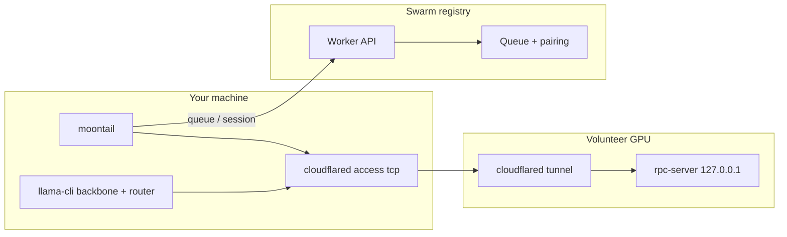

<p align="center">
  
</p>

<h1 align="center">moontail — volunteer GPU, frontier MoE</h1>

<p align="center">
  <strong>Tiny glue, immense model.</strong> Run <strong>Kimi K2-Instruct</strong> — 1T-class MoE, 384 routed experts — across a reciprocal swarm of home GPUs.<br/>
  No datacenter. No central inference fleet. Lend expert compute, earn your place in the queue.
</p>

<p align="center">
  <a href="LICENSE"></a>
  <a href="docs/SECURITY.md"></a>
  <a href="docs/BENCHMARKS.md"></a>
  
</p>

<p align="center">
  <a href="docs/DEVELOPER.md">Developer guide</a> ·
  <a href="docs/SECURITY.md">Security</a> ·
  <a href="docs/BENCHMARKS.md">Benchmarks</a> ·
  <a href="docs/TAILSCALE.md">Tailscale mesh</a> ·
  <a href="docs/VOLUNTEER_TERMS.md">Volunteer terms</a>
</p>

---

**MoonTail** is a reciprocal inference swarm you can join today, and an open research preview for *distributed MoE without a datacenter*. Its goal is simple: let consumer and prosumer GPUs cooperate on a frontier model — attention and routing local, routed expert FFN remote — with honest measurement, localhost-only ggml-rpc, and Cloudflare Tunnel + Access as the only cross-machine path.

One target model runs today: **[Kimi K2-Instruct](https://huggingface.co/moonshotai/Kimi-K2-Instruct)** (`deepseek2`, 61 layers, 384 experts, 8 experts/token) — upstream [llama.cpp](https://github.com/ggml-org/llama.cpp) master, tensor offload via `-ot`, the same `moontail init` / `moontail prompt` CLI everywhere. Full stack below ↓

MoonTail is deliberately thin (~800 lines of C + config): it does not implement MoE math, custom kernels, or a new wire protocol. It pairs volunteers, opens transport to expert RPC, and execs `llama-cli`. **Reciprocity is the product:** you cannot prompt until you volunteer. Cross-machine traffic uses **Tailscale mesh** (default) or Cloudflare Tunnel + Access — see [docs/TAILSCALE.md](docs/TAILSCALE.md).

```bash
$ moontail init --accept-terms
  🌙 moontail — Kimi K2-Instruct · 384 experts · reciprocal swarm
  ✓ peer registered · rpc-server 127.0.0.1:50052 · tunnel up
  … waiting for 2 more volunteer(s) …
  ✓ swarm ready

$ moontail prompt "Explain mixture-of-experts in one paragraph."
  ◆ queued · position 1 · session paired · llama-cli running
  ◆ A mixture-of-experts model routes each token to a small subset of …
```

---

## The research mission

Frontier MoE should not require owning a rack of GPUs *and* a rack of lawyers. MoonTail's research target: **can home machines split a trillion-class MoE honestly** — same router semantics, same weight precision, expert tensors on whoever has VRAM tonight — without exposing ggml-rpc to the open internet?

That means treating **volunteer GPU, requester GPU, and Cloudflare edge** as one placement problem: who holds the backbone, who holds `blk.*.ffn_{gate,up,down}_exps`, how sessions pair, how queue depth behaves when three laptops wake up at 2 a.m. Nothing ships because a diagram looked clever; it ships when gates produce numbers on real hardware.

The practical consequence is accessibility: run Kimi K2 with weights and VRAM you already have, lend the experts you don't need this hour, and change the glue that does it. Not renting intelligence behind a closed API — **holding it together as a swarm**: probing pairing limits, measuring RPC latency, improving the queue. The codebase is small enough that the next useful patch can come from anyone willing to measure it.

---

## The idea

Kimi K2 activates only a **fraction** of its parameters per token — 8 of 384 routed experts per layer, plus shared experts and a dense backbone. You don't need every GPU to hold the whole model; you need **a split that respects llama.cpp's MoE forward**:

| Stays on the **requester** (your machine) | Can run on a **volunteer** (remote GPU) |
|-------------------------------------------|----------------------------------------|
| Token embed, output head | `blk.{L}.ffn_gate_exps` |
| Router `ffn_gate_inp` | `blk.{L}.ffn_up_exps` |
| Shared experts | `blk.{L}.ffn_down_exps` |
| MLA / attention, KV state | Routed expert weights only |

MoonTail does not reimplement that split — it loads patterns from [`config/tensor-overrides.kimi-k2`](config/tensor-overrides.kimi-k2) and passes them to `llama-cli -ot …=RPC0`. Cross-machine traffic is **ggml-rpc over an authenticated tunnel**, not a bespoke tensor protocol.

**Reciprocity** keeps the swarm fed: idle GPUs register as volunteers; prompters join the same pool they draw from. FIFO queue → session → one volunteer per prompt (v1 pairing model). More volunteers → shorter waits → more concurrent prompts the registry can admit.

Think of MoonTail as **air traffic control for expert shards**, not the plane. The engine is llama.cpp; the swarm is whoever runs `moontail init` tonight.

---

## How it works

### The per-prompt path

**volunteer → queue → session → tunnel → llama**

Every prompt walks the same steps. Placement decides *which volunteer* holds your expert range; router decisions and weight precision are unchanged whether the expert answered from VRAM next door or over Cloudflare.

1. **`moontail init --accept-terms`** — fork `moontail-volunteer`: `rpc-server` on **127.0.0.1 only**, outbound `cloudflared tunnel`, heartbeat `POST /register`.
2. **Swarm gate** — registry waits until `MIN_VOLUNTEERS` (default **3**) peers are live.
3. **`moontail prompt "…"`** — `POST /queue`, poll until ready, `POST /session` with Cloudflare Access creds.
4. **Local proxy** — `cloudflared access tcp` to `127.0.0.1:50053`; `llama-cli -rpc … -ot config/tensor-overrides.kimi-k2`.
5. **Release** — `POST /session/release` on exit; volunteer goes idle for the next peer.



### One volunteer, one client (v1)

Upstream ggml-rpc is proof-of-concept: **one active rpc-server client per volunteer**. Session pairing is first-idle peer covering your expert range — no RTT sorting yet. [Gate 5](docs/BENCHMARKS.md) measures the ceiling; don't market beyond it.

### Never expose rpc-server

Misses on security are unacceptable, so the stack is rigid: **127.0.0.1 bind only**, tunnel + Access for every cross-machine byte, `--skip-tunnel` refused unless the worker URL is localhost (dev/Gate 4). See [SECURITY.md](docs/SECURITY.md) for the full policy and CVE pin on llama.cpp.

---

## Get started

You need four things: **the client**, **K2 weights**, **a GPU**, and **cloudflared**. Step-by-step below; deeper detail in [DEVELOPER.md](docs/DEVELOPER.md).

### 1. Install MoonTail

```bash
git clone https://github.com/rockybalboan19/MoonTail.git && cd MoonTail
bash install.sh
export PATH="$HOME/.moontail/bin:$PATH"
```

Builds `moontail`, `moontail-volunteer`, and (with `cmake`) llama.cpp RPC tools into `~/.moontail/bin`. Needs: `git`, `gcc`, `curl`, `cmake`, `cloudflared`.

Or one-liner:

```bash
curl -fsSL https://raw.githubusercontent.com/rockybalboan19/MoonTail/main/install.sh | bash
export PATH="$HOME/.moontail/bin:$PATH"
```

### 2. Connect to the swarm (Tailscale)

Install [Tailscale](https://tailscale.com/download) and join the operator's tailnet. Then:

```bash
export MOONTAIL_WORKER=$(grep -v '^#' config/official-worker.url | grep -v '^$' | head -1)
export MOONTAIL_TRANSPORT=tailscale
export MOONTAIL_TAILSCALE_HOST=$(tailscale ip -4)   # optional — auto-detected at init
export HF_TOKEN=hf_...   # optional: stream-convert weights
```

PowerShell:

```powershell
$env:MOONTAIL_WORKER = "https://moontailai.yash-d-sharma-2021.workers.dev"
$env:MOONTAIL_TRANSPORT = "tailscale"
$env:MOONTAIL_TAILSCALE_HOST = (tailscale ip -4)
```

Full guide: [docs/TAILSCALE.md](docs/TAILSCALE.md). Cloudflare Access transport is also supported — see [docs/DEVELOPER.md](docs/DEVELOPER.md).

### 3. Get Kimi K2 weights

K2 at Q4 is **~500 GB+** class — plan storage honestly.

| Path | Notes |
|------|-------|
| Community **split GGUF** | Fastest try-it path; point `model=` at first shard |
| `bash scripts/pull-k2.sh` | Stream HF → GGUF; hours; needs `HF_TOKEN` |

Architecture: `deepseek2` on upstream llama.cpp `master`. Config reference: [`config/kimi-k2.example.config.json`](config/kimi-k2.example.config.json).

### 4. Volunteer, then prompt

**One command** (after install + Tailscale logged in):

```bash
moontail setup
```

That detects your Tailscale IP, connects to the official swarm, and starts volunteering your GPU.

**Interactive shell** (type `help` anytime):

```bash
moontail
```

```
moontail> help
moontail> join        # volunteer GPU
moontail> status      # swarm / queue
moontail> prompt hello Kimi K2
moontail> quit
```

You'll see `Waiting for N more user(s)…` until enough peers register, then `Swarm ready`. **More GPUs in the swarm = shorter queues for everyone.**

Read [VOLUNTEER_TERMS.md](docs/VOLUNTEER_TERMS.md) before `init` — you are lending real GPU cycles.

---

## CLI

| Command | What |
|---------|------|
| `moontail init --accept-terms` | Join as volunteer — rpc-server + Tailscale serve + register |
| `moontail status` | Pool size, swarm ready, queue depth |
| `moontail prompt "…"` | FIFO queue → session → llama-cli |

---

## Measurement before marketing

MoonTail uses **gates** — scripted benchmarks that write JSON under `results/` — before any perf claim ships. No tok/s on the README hero until Gate 4 (localhost RPC + `-ot`) and Gate 6 (auth tunnel) pass on your hardware.

| Gate | Measures |
|------|----------|
| [Gate 3](tools/gate3_depgraph.py) | K2 checkpoint dependency graph |
| [Gate 4](tools/gate4_expert_rpc.sh) | Expert RPC latency via `-ot` |
| [Gate 5](tools/gate5_concurrent.sh) | Pairing-limited concurrency |
| [Gate 6](tools/gate6_auth_tunnel.sh) | Access tunnel path, no public rpc |

Full definitions: [docs/BENCHMARKS.md](docs/BENCHMARKS.md).

```bash
bash scripts/check-loc.sh && bash scripts/check-security.sh
python tools/gate3_depgraph.py config/kimi-k2.example.config.json
```

---

## Repo layout

```
MoonTail/
├── client/
│   ├── moontail.c          Requester CLI — queue, session, llama exec
│   ├── moon.h              Terminal banner
│   └── protocol.h          Shared constants
├── server/
│   └── volunteer.c         rpc-server supervisor + tunnel + register
├── config/
│   ├── tensor-overrides.kimi-k2
│   ├── kimi-k2.example.config.json
│   └── official-worker.url Swarm URL (used by install.sh)
├── tools/                  Measurement gates
├── scripts/                install, security checks, pull-k2
├── docs/                   DEVELOPER, SECURITY, BENCHMARKS
└── vendor/llama.cpp/       Inference engine (submodule, security-pinned)
```

The runtime path stays flat: two C binaries, config for tensor patterns, llama.cpp for math. Control-plane pairing logic runs on Cloudflare Workers — not in this tree.

---

## Contributing

Client, volunteer, gate, and config patches welcome. Before opening a PR:

```bash
bash scripts/check-loc.sh && bash scripts/check-security.sh
```

Read [DEVELOPER.md](docs/DEVELOPER.md) for API contracts, security invariants, and the feature decision tree. **Publish negative benchmark results too** — a well-controlled failure beats an unexplained fast number.

---

## Why "MoonTail"

A comet tails the sky — bright head, long diffuse trail. MoonTail tails a frontier MoE: a small bright core of glue, a long trail of volunteers carrying the expert weights the router actually touches. You don't need the whole moon on one GPU; you need to follow where the tokens go.

---

## Acknowledgements

MoonTail is glue; the model is a gift. Thank you to **Moonshot AI** for Kimi K2-Instruct, **ggml-org** for llama.cpp and ggml-rpc, and **Cloudflare** for Tunnel + Access. And to every volunteer who registers a GPU and waits in the queue with the rest of us.

---

## License

MIT — see [LICENSE](LICENSE). Kimi K2 weights are subject to [Moonshot's license](https://huggingface.co/moonshotai/Kimi-K2-Instruct) on Hugging Face.
