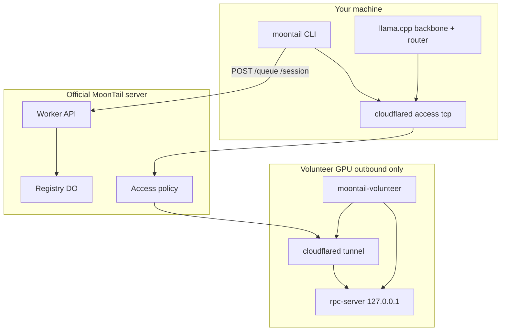

<p align="center">
  
</p>

<p align="center">
  <em>tail the moon, split the experts</em><br/>
  <strong>Volunteer your GPU. Queue for Kimi K2.</strong><br/>
  Reciprocal MoE inference — home GPUs, frontier model, zero central GPU.<br/>
  <strong>Research preview</strong> — ~800 lines of glue around llama.cpp + Cloudflare.
</p>

<p align="center">
  <a href="LICENSE"></a>
  <a href="docs/SECURITY.md"></a>
  <a href="docs/BENCHMARKS.md"></a>
  
</p>

---

## One official swarm — join, don't host

MoonTail runs **a single community control plane** operated by the **MoonTail project only**.

| You are | What to do |
|---------|------------|
| **GPU owner** | Install → point at the **official** `MOONTAIL_WORKER` → `moontail init --accept-terms` → `moontail prompt` |
| **Not a maintainer** | **Do not** deploy your own Cloudflare Worker or fork the registry — you won't be part of the real swarm |

The official server URL is in [`config/official-worker.url`](config/official-worker.url) (also printed by `install.sh`).

---

## Join the swarm

**You cannot prompt until you volunteer.** Volunteer your GPU first, wait for the swarm to be ready, then queue a prompt.

### Before you start

| Requirement | Notes |
|-------------|--------|
| **Official `MOONTAIL_WORKER`** | From [`config/official-worker.url`](config/official-worker.url) — **not** your own Worker |
| **GPU + drivers** | Enough VRAM for Kimi K2 (or a community Q4 split GGUF) |
| **K2 weights** | Community split GGUF **or** `bash scripts/pull-k2.sh` with `HF_TOKEN` |
| **cloudflared tunnel** | Outbound tunnel; hostname you register with the project / in `MOONTAIL_TUNNEL_HOST` |
| **Terms** | `--accept-terms` — [docs/VOLUNTEER_TERMS.md](docs/VOLUNTEER_TERMS.md) |

### Step 1 — Install

```bash
curl -fsSL https://raw.githubusercontent.com/rockybalboan19/MoonTail/main/install.sh | bash
export PATH="$HOME/.moontail/bin:$PATH"
```

Needs: `git`, `gcc`, `curl`, `cmake`, `cloudflared`, `python3` (optional).

### Step 2 — Connect to the official swarm

```bash
# Official URL only (see config/official-worker.url)
export MOONTAIL_WORKER=https://moontail.example.workers.dev

# Your tunnel hostname (unique per GPU machine)
export MOONTAIL_TUNNEL_HOST=volunteer-YOURNAME.example.com

# Optional: HF stream-convert
export HF_TOKEN=hf_...
```

Or after install, set `worker=` in `~/.moontail/config` from `official-worker.url`.

### Step 3 — Volunteer your GPU (join)

```bash
moontail init --accept-terms
```

This:

1. Saves **peer_id** + **peer_token** in `~/.moontail/config`
2. Starts **moontail-volunteer** (`rpc-server` on **127.0.0.1 only** + your tunnel)
3. Registers with the **official** MoonTail server

You'll see:

- `Waiting for N more user(s)…` — need more GPUs (`MIN_VOLUNTEERS`, default **3**)
- `Swarm ready` — you can prompt

```bash
moontail status
```

**More GPUs = more people run Step 1–3** on other machines (each with its own tunnel hostname).

### Step 4 — Prompt (after join + swarm ready)

Must have run **`init --accept-terms`** on this machine first:

```bash
export MOONTAIL_WORKER=https://moontail.example.workers.dev   # official URL only
moontail prompt "Hello Kimi K2"
```

FIFO queue → session → Kimi K2 via llama.cpp + volunteer expert offload.

---

## What MoonTail is

**MoonTail** splits **Kimi K2-Instruct** across home GPUs: your machine runs attention/router; routed expert FFN runs on another volunteer via `-ot` + ggml-rpc over Cloudflare Tunnel + Access. **Reciprocity:** donate GPU with `init`, then get queue access with `prompt`. Research preview — see [docs/SECURITY.md](docs/SECURITY.md).

---

## Architecture



---

## CLI

| Command | What |
|---------|------|
| `moontail init --accept-terms` | **Join** — volunteer GPU + register with official swarm |
| `moontail status` | Waiting room / pool / queue |
| `moontail prompt "…"` | Queue a prompt (must have joined first) |

---

## Security

| Layer | Protects |
|-------|----------|
| **127.0.0.1 rpc-server** | No public ggml-rpc |
| **Cloudflare Access** | Tunnel auth on official server |
| **peer_token** | Register / queue / release |
| **Single control plane** | One operator; no rogue Workers in the product path |

[docs/SECURITY.md](docs/SECURITY.md) · [docs/VOLUNTEER_TERMS.md](docs/VOLUNTEER_TERMS.md)

---

## Weights

K2 Q4 is **~500GB+**. Fastest: community **split GGUF** → `model=` in `~/.moontail/config`. Slow: `bash scripts/pull-k2.sh`.

Upstream [llama.cpp](https://github.com/ggml-org/llama.cpp) `master` (`deepseek2`).

---

## Contributing (code)

Glue / gates / client patches welcome. **Server hosting is not a community operation** — see [docs/HOSTING.md](docs/HOSTING.md) (maintainers only).

```bash
bash scripts/check-loc.sh && bash scripts/check-security.sh
```

[docs/DEVELOPER.md](docs/DEVELOPER.md) · [docs/BENCHMARKS.md](docs/BENCHMARKS.md)

---

## License

MIT — see [LICENSE](LICENSE).
