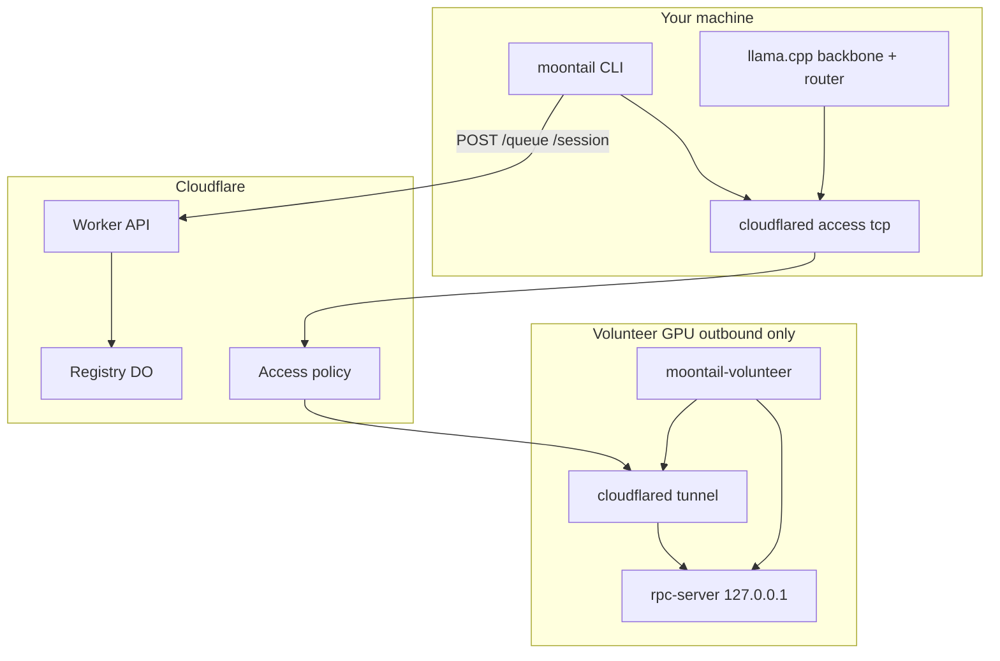

<p align="center">
  
</p>

<p align="center">
  <em>tail the moon, split the experts</em><br/>
  <strong>Volunteer your GPU. Queue for Kimi K2.</strong><br/>
  Reciprocal MoE inference — home GPUs, frontier model, zero central GPU.<br/>
  <strong>Research preview</strong> — ~800 lines of glue around llama.cpp + Cloudflare.
</p>

<p align="center">
  <a href="LICENSE"></a>
  <a href="docs/SECURITY.md"></a>
  <a href="docs/BENCHMARKS.md"></a>
  
</p>

---

## The deal

**MoonTail** is a reciprocal swarm for **Kimi K2-Instruct**:

1. **`moontail init --accept-terms`** — volunteer your home GPU (localhost `rpc-server` + outbound tunnel)
2. **Waiting room** — until enough peers join (`MIN_VOLUNTEERS`, default 3)
3. **`moontail prompt "…"`** — FIFO queue; when a slot opens, llama.cpp runs backbone local + expert FFN on a volunteer via `-ot` + ggml-rpc
4. **You must volunteer to prompt** — reciprocity, not a free public API

> ggml-rpc is upstream proof-of-concept. We bind **127.0.0.1 only** and require **Cloudflare Access** on tunnels in production. See [docs/SECURITY.md](docs/SECURITY.md) and [docs/VOLUNTEER_TERMS.md](docs/VOLUNTEER_TERMS.md).

---

## Quick start

```bash
curl -fsSL https://raw.githubusercontent.com/ysharmcode/MoonTail/main/install.sh | bash
export MOONTAIL_WORKER=https://your-worker.workers.dev
export MOONTAIL_TUNNEL_HOST=volunteer-1.example.com   # your cloudflared hostname
export HF_TOKEN=hf_...   # optional: stream-convert K2 from Hugging Face

moontail init --accept-terms
moontail status
moontail prompt "Hello Kimi K2"
```

**Weights:** full K2 GGUF is large (~500GB+ class at Q4). For a quick try, use a community split GGUF and set `model=` in `~/.moontail/config`, or run `bash scripts/pull-k2.sh` (hours, streamed HF convert).

Uses upstream [llama.cpp](https://github.com/ggml-org/llama.cpp) `master` (`deepseek2` arch).

---

## Architecture



---

## CLI

```
moontail init --accept-terms   Volunteer GPU + join swarm
moontail status                Pool / queue
moontail prompt "text"         FIFO queued Kimi K2 prompt
```

Dev only: `--skip-tunnel` with localhost `--worker` (refused otherwise).

---

## Security (infra only)

| Layer | Protects |
|-------|----------|
| **127.0.0.1 rpc-server** | No public ggml-rpc bind |
| **Cloudflare Access** | Sessions fail closed without CF secrets |
| **peer_token** | Register / queue / release auth |
| **Rate limits** | Register / queue / session spam |

Full policy: [docs/SECURITY.md](docs/SECURITY.md). Launch checklist: [docs/KIMI_K2_LAUNCH.md](docs/KIMI_K2_LAUNCH.md).

---

## Measurement gates

We don't ship scheduler fantasies. We ship numbers.

```bash
python tools/gate3_depgraph.py config/kimi-k2.example.config.json
MODEL=model.gguf bash tools/gate4_expert_rpc.sh
```

Details: [docs/BENCHMARKS.md](docs/BENCHMARKS.md) · Developers: [docs/DEVELOPER.md](docs/DEVELOPER.md)

---

## Contributing

1. `bash scripts/check-loc.sh`
2. `bash scripts/check-security.sh`
3. Run gates before claiming perf improvements

---

## License

MIT — see [LICENSE](LICENSE).
