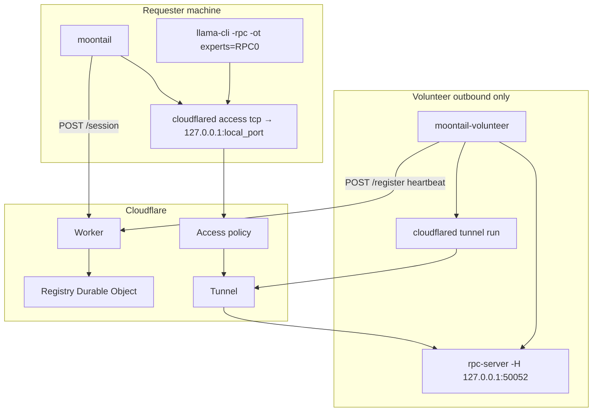
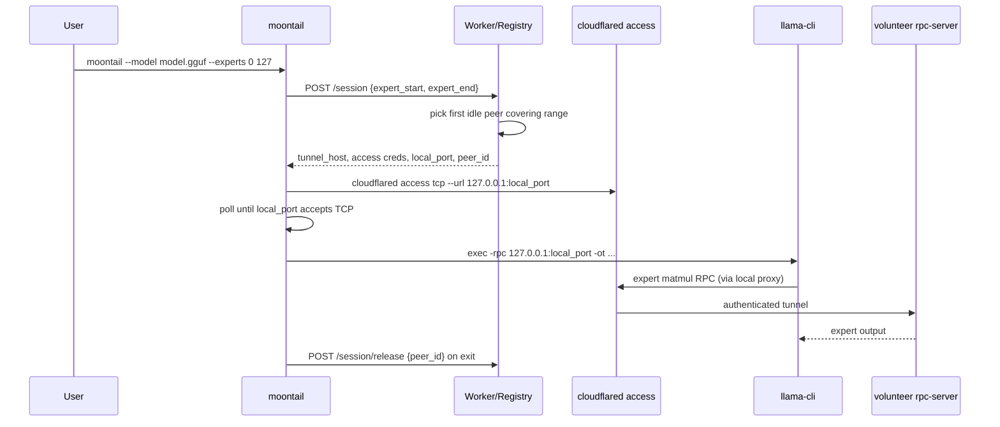

# MoonTail — Developer Guide

Master reference for engineers working on the **Reciprocal MoE Swarm**: product intent, system design, security invariants, APIs, config, and measurement workflow.

For user-facing quick start see [README](../README.md). For security policy detail see [SECURITY.md](SECURITY.md). For launch checklist see [KIMI_K3_LAUNCH.md](KIMI_K3_LAUNCH.md). FAQ: [FAQ.md](FAQ.md).

---

## 1. Product

### What MoonTail is

**MoonTail** is a thin orchestration layer (~800 LOC custom code) around **llama.cpp** that enables *reciprocal* MoE inference:

- The **requester** (your machine) runs the **backbone**: attention, routing, shared experts, KV/state, speculative verify.
- **Volunteers** (remote GPUs, outbound-only) run **routed expert FFN** weights via ggml-rpc.
- **Cloudflare** provides session pairing and authenticated TCP transport — not tensor hosting.

MoonTail does **not** implement inference, MoE routing, or a custom wire protocol. It:

1. Opens a control-plane session.
2. Spawns `cloudflared access tcp` to a local proxy port.
3. Execs `llama-cli` with `-rpc 127.0.0.1:PORT` and `-ot` tensor overrides from config.

### What MoonTail is not

- Not a model host or weight CDN.
- Not a scheduler that optimizes RTT (v1: first idle peer covering shard).
- Not a trustless compute network (no cryptographic verification of expert outputs in v1).
- Not a content moderation or prompt logging service — prompts/outputs are opaque compute payloads.

### Target model: Kimi K3

| Property | Value |
|----------|-------|
| HF repo | `moonshotai/Kimi-K3` |
| GGUF arch | `kimi-k3` (upstream llama.cpp master) |
| Layers | 93 |
| Routed experts | 896 |
| Experts per token | 16 |

Set `MOONTAIL_MODEL` to your GGUF path. Config: `config/kimi-k3.example.config.json`. Convert: `vendor/llama.cpp/conversion/kimi_k3.py`.

### Design principles

1. **Config over code** — tensor patterns, shard manifests, depgraph templates live in `config/`.
2. **Measurement before scheduler** — six gates must produce numbers before perf claims or RTT sorting.
3. **LOC budget** — enforced by `scripts/check-loc.sh` (client <550, server <2000, tools+scripts <350).
4. **Security as architecture** — ggml-rpc never faces the public internet; Tunnel + Access is the cross-machine API.

---

## 2. Architecture

### Component map

| Component | Path | Role |
|-----------|------|------|
| **moontail** | `client/moontail.c` | Requester CLI: session, tunnel, llama exec |
| **moontail-volunteer** | `server/volunteer.c` | Supervises `rpc-server` (127.0.0.1) + outbound `cloudflared tunnel` |
| **Control plane Worker** | **MoontailAI** (private repo) | HTTP router: `/health`, `/register`, `/session`, `/session/release` |
| **Registry DO** | **MoontailAI** (private repo) | Durable Object: peer table, session pairing, Access creds |
| **llama.cpp** | `vendor/llama.cpp` | Inference engine (submodule, security-pinned) |
| **Gates / metadata** | `tools/gate*.sh`, `tools/gate3_depgraph.py` | Measurement and HF metadata ingestion |
| **Config** | `config/*` | Tensor overrides, shard manifests, tunnel templates |

### System diagram



Pipeline mode removed for v1: every hop still relays through the requester's local cloudflared proxies (no direct volunteer-to-volunteer path), so it does not shorten the RTT chain—only spreads load. Star topology only until usage data shows load distribution, not RTT, is the bottleneck.

### Inference split (intended)

When llama.cpp can load the checkpoint, expert offload uses **buffer overrides** (`-ot`), not custom RPC calls:

| Stays local (requester) | Can go remote (volunteer RPC) |
|-------------------------|-------------------------------|
| Token embed, output head | `blk.{L}.ffn_gate_exps` |
| Router `ffn_gate_inp` | `blk.{L}.ffn_up_exps` |
| Shared experts `ffn_*_shexp` | `blk.{L}.ffn_down_exps` |
| KDA SSM + MLA KV/state | Routed expert weight tensors only |
| Block AttnRes block history | — |

MoE forward in llama.cpp uses **`mul_mat_id`** (batched top-k expert matmuls). Per MoE layer ≈ **3 RPC-bound ops**, not 16×3 independent expert calls.

Patterns are loaded from `config/tensor-overrides.kimi-k3` (default).

### Session lifecycle



### Pairing model (v1)

- **One active rpc-server client per volunteer** (upstream ggml-rpc limitation).
- **One session → one volunteer**; concurrent stream count is bounded by idle volunteer count (Gate 5 reports `pairing_limited`).
- Selection policy: **first idle peer** whose `[expert_start, expert_end]` covers the session request. No RTT sorting in v1.

### Volunteer lifecycle

1. Parse `tunnel_host` from `config/cloudflared-volunteer.yml` ingress hostname.
2. Optionally load `--shard-manifest` JSON for expert range.
3. Fork/spawn `rpc-server -H 127.0.0.1 -p PORT [-m model.gguf]`.
4. Fork/spawn `cloudflared tunnel --config ... run`.
5. `POST /register` every 30s; on SIGTERM kill children and `POST /deregister`.
6. Restart dead rpc-server/tunnel with exponential backoff (max 60s).

---

## 3. Control plane API

Base URL: **official** `MOONTAIL_WORKER` from [`config/official-worker.url`](../config/official-worker.url) only (maintainers operate one server; local dev: `http://127.0.0.1:8787`).

### `GET /health`

Returns pool statistics for Gate 5 and ops dashboards.

```json
{
  "ok": true,
  "volunteer_pool_size": 3,
  "idle_volunteers": 2
}
```

### `POST /register`

Volunteer heartbeat. Body:

```json
{
  "peer_id": "volunteer-1",
  "peer_token": "hex-secret-from-moontail-init",
  "tunnel_host": "volunteer-1.example.com",
  "expert_start": 0,
  "expert_end": 383,
  "busy": false
}
```

`tunnel_host` must be the Cloudflare Tunnel hostname (from cloudflared config), **not** the peer_id. `peer_token` is hashed server-side (SHA-256).

### `POST /deregister`

Remove peer on volunteer shutdown. Body: `{ "peer_id": "...", "peer_token": "..." }`.

### `POST /queue`

Enqueue prompt (registered volunteer only). Body:

```json
{
  "peer_id": "mt-123",
  "peer_token": "...",
  "prompt": "Hello"
}
```

### `POST /session`

Open session after job is `ready`. Body:

```json
{
  "peer_id": "mt-123",
  "peer_token": "...",
  "job_id": "uuid"
}
```

When `TRANSPORT=cloudflare` and Access secrets are **unset**, returns **tunnel-only** (public HN launch — no Zero Trust):

```json
{
  "transport": "cloudflare",
  "access_mode": "tunnel_only",
  "rpc_host": "gpu-you.example.com",
  "rpc_port": 50052,
  "tunnel_host": "gpu-you.example.com",
  "peer_id": "volunteer-1",
  "job_id": "uuid",
  "ttl_sec": 3600
}
```

When Access secrets **are** set:

```json
{
  "transport": "cloudflare",
  "tunnel_host": "volunteer-1.example.com",
  "access_client_id": "...",
  "access_client_secret": "...",
  "access_token": "",
  "local_port": 50053,
  "peer_id": "volunteer-1",
  "ttl_sec": 3600,
  "access_mode": "cloudflare_access_service_token"
}
```


Failure (409): `{ "error": "no idle volunteer", "volunteer_pool_size": N }`.

### `POST /session/release`

Clear `busy` on volunteer. Body: `{ "peer_id": "volunteer-1" }`. Called by moontail on exit.

### `GET /peers`

Always **403** — peer list requires an active session path; no public peer enumeration.

### Registry internals

- **Stale eviction:** peers with `busy: false` and `last_seen` older than `PEER_STALE_SEC` (default 120) are removed.
- **TTL cap:** `ACCESS_TOKEN_TTL_SEC` capped at `SESSION_TTL_SEC + 300` (5 min grace).
- **Persistence:** peer map stored in Durable Object storage key `peers`.

Worker env vars (set in **MoontailAI** `wrangler.toml` or Worker secrets):

| Var | Default | Purpose |
|-----|---------|---------|
| `ACCESS_TOKEN_TTL_SEC` | 3600 | Access credential lifetime |
| `SESSION_TTL_SEC` | 3600 | Session reference TTL |
| `PEER_STALE_SEC` | 120 | Idle peer eviction |
| `MIN_VOLUNTEERS` | `1` (demo) | Swarm gate before prompts |

---

## 4. Client and volunteer CLIs

### moontail (requester)

```
moontail [options] -- [llama-cli args...]

  --worker URL           Control plane URL
  --model PATH           GGUF path (-m)
  --llama PATH           llama-cli binary
  --tensor-config F      -ot override file (default config/tensor-overrides.kimi-k3)
  --experts START END    Session expert shard range
  --local-rpc PORT       Dev: skip tunnel, use 127.0.0.1:PORT
  --skip-tunnel          Dev: requires --worker on localhost
  --quiet, -q
```

**Dev path:** `--skip-tunnel` with localhost worker connects llama directly to local rpc-server (Gate 4). Refused if `--worker` is not localhost.

**Production path (tunnel-only):** POST /session → `access_mode: tunnel_only` → `llama-cli -rpc tunnel_host:50052` directly (no local cloudflared proxy).

**Production path (Access):** POST /session → spawn `cloudflared access tcp` with service token creds → poll `127.0.0.1:50053` → exec llama → release session on exit.

### moontail-volunteer

```
moontail-volunteer [options]

  --worker URL
  --rpc PATH             rpc-server binary
  --model PATH           GGUF for rpc-server -m
  --tunnel CFG           cloudflared config (default config/cloudflared-volunteer.yml)
  --shard-manifest F     JSON expert_ranges (overrides --experts)
  --peer-id ID
  --experts START END
  --rpc-port PORT        default 50052, bind 127.0.0.1 only
```

**No `--skip-tunnel`** on volunteer — security invariant enforced in CI.

---

## 5. Configuration

| File | Purpose |
|------|---------|
| `config/tensor-overrides.kimi-k3` | `-ot` patterns for expert → RPC0 |
| `config/kimi-k3.example.config.json` | K3 HF fields (Gate 3 input) |
| `config/shard-manifest.example.json` | Volunteer shard schema instance |
| `config/shard-manifest.schema.json` | JSON schema for shard manifests |
| `config/cloudflared-volunteer.yml` | Tunnel ingress → `tcp://127.0.0.1:50052` |
| `config/depgraph-templates.json` | `kimi_k3` layer template |
| `config/hf-kimi-k3-meta/` | Downloaded HF metadata |

Refresh K3 metadata (no weights):

```bash
python tools/gate3_depgraph.py --fetch-k3
```

Example shard manifest:

```json
{
  "model": "kimi-k3",
  "expert_ranges": [{
    "layer_start": 0,
    "layer_end": 60,
    "expert_start": 0,
    "expert_end": 383
  }]
}
```

---

## 6. Security

### Threat model (v1)

| Threat | Direction | v1 mitigation |
|--------|-----------|---------------|
| Unauthenticated internet → volunteer RPC | External → volunteer | rpc-server on 127.0.0.1 only; tunnel + Access required |
| Authenticated requester → volunteer RCE | Client → server | llama.cpp pin ≥ b8492; same-day CVE bump policy |
| Malicious volunteer → wrong tensors | Server → client | Reputation / shard config; **no crypto verify** |
| Accidental prod tunnel bypass | Operator error | `--skip-tunnel` refused unless worker is localhost |
| Peer enumeration | Recon | `GET /peers` → 403 |

### Non-negotiable invariants

1. **`rpc-server` binds `127.0.0.1` only** — never `0.0.0.0`, never public port-forward.
2. **Cross-machine path is Cloudflare Tunnel + Access only** — ggml-rpc is not the public API.
3. **One active ggml-rpc client per volunteer** (v1 pairing).
4. **`--skip-tunnel` is moontail-only**; volunteer has no tunnel bypass.
5. **Version pin is a security control** — submodule ≥ `b8492`; CVE advisories trigger same-day bump + redeploy.
6. **Access token TTL ≤ session + 5 minutes.**
7. **No tunnel hostname or peer list without successful `POST /session`.**

Enforced by `scripts/check-security.sh` in CI.

### What crosses the network

- **Tunnel:** serialized ggml-rpc matmul traffic (expert weights stay on volunteer; activations cross the wire).
- **Control plane:** JSON session/register metadata only — no model weights.
- **Not sent:** full checkpoint, arbitrary code from requester to volunteer.

### Operator checklist

See [SECURITY.md](SECURITY.md). Before any deploy:

- [ ] `bash scripts/check-security.sh` passes
- [ ] `bash scripts/check-loc.sh` passes
- [ ] Volunteer outbound tunnel only (no inbound RPC)
- [ ] CF Access service token secrets set on Worker
- [ ] `--skip-tunnel` never used with production worker URL

---

## 7. Measurement gates

MoonTail ships **measurement infrastructure**, not performance promises. All gates write JSON under `results/` (gitignored).

| Gate | Script | Measures |
|------|--------|----------|
| 1 | `gate1_backbone.sh` | Local backbone ms (experts on CPU) |
| 2 | *(deferred)* | Speculative decoding — cut for K3 launch |
| 3 | `gate3_depgraph.py` | Layer dependency graph (K3 kimi_k3) |
| 4 | `gate4_expert_rpc.sh` | Expert RPC latency (localhost); also writes `phase0_localhost_rpc.json` |
| 5 | `gate5_concurrent.sh` | Concurrent sessions vs volunteer pool (`pairing_limited`) |
| 6 | `gate6_auth_tunnel.sh` | Session + Access path; fails if raw RPC port exposed |

Quick offline run:

```bash
python tools/gate3_depgraph.py
python tools/gate3_depgraph.py config/kimi-k3.example.config.json
MODEL=proxy.gguf bash tools/gate4_expert_rpc.sh   # needs GGML_RPC build
```

Performance model (honest):

```
tok/s ≈ (accepted_tokens_per_round × 1000) / (backbone_ms + expert_rpc_ms + rtt_ms)
```

For K3 over WAN, many MoE RPC sync points per decode token makes RTT dominant until measured. See [BENCHMARKS.md](BENCHMARKS.md).

---

## 8. Development workflow

### Build

```bash
git submodule update --init --recursive

# MoonTail binaries
gcc -O2 -Wall -std=c11 -Iclient -o moontail client/moontail.c
gcc -O2 -Wall -std=c11 -Iclient -o moontail-volunteer server/volunteer.c

# llama.cpp with RPC
cmake -S vendor/llama.cpp -B vendor/llama.cpp/build -DGGML_RPC=ON
cmake --build vendor/llama.cpp/build --config Release --target rpc-server llama-bench llama-cli
```

Control plane dev lives in the private **MoontailAI** repo (`npm install && npm run dev` there).

### CI

`.github/workflows/ci.yml`:

- LOC budget, security checks, Gate 3 offline
- Client/volunteer compile

Optional `k3-gates` job (`workflow_dispatch`): HF metadata fetch, GGML_RPC build, Gate 4 when `K3_PROXY_GGUF` var set.

### LOC budget

| Area | Cap |
|------|-----|
| `client/` | 550 |
| `server/` | 2000 |
| `tools/` + `scripts/` | 350 |
| Total (incl. docs/SECURITY) | 2800 |

See `scripts/check-loc.sh`.

Prefer extending `gate3_depgraph.py` over new tools. Prefer `config/` over C/TS for model-specific logic.

### Adding a feature — decision tree

1. **Can it be config?** → add to `config/`, not code.
2. **Does it need new inference ops?** → upstream llama.cpp, not MoonTail.
3. **Does it need new transport?** → stop; ggml-rpc + Tunnel only.
4. **Does it improve perf?** → add/adjust a gate first; no scheduler until gates pass.

---

## 9. Kimi K3 status (developer)

**Go/no-go:** Gate 4 on real K3 GGUF + `-ot` expert RPC before HN scale.

| Item | Detail |
|------|--------|
| Submodule | `vendor/llama.cpp` with `LLM_ARCH_KIMI_K3` |
| Converter | `conversion/kimi_k3.py` |
| Expert `-ot` | `blk.*.ffn_{gate,up,down}_exps` → RPC0 |

Full checklist: [KIMI_K3_LAUNCH.md](KIMI_K3_LAUNCH.md).

---

## 12. Launch queue (community Kimi K3)

**Flow:** `moontail init --accept-terms` → volunteer registers with `peer_token` → waiting room until `MIN_VOLUNTEERS` → `moontail prompt "…"` → FIFO queue → session (requires Cloudflare Access in prod).

| Env | Default | Purpose |
|-----|---------|---------|
| `MIN_VOLUNTEERS` | 3 | Swarm not ready until this many `/register` |
| `MAX_CONCURRENT_PROMPTS` | 3 | Cap simultaneous prompt sessions |
| `MOONTAIL_WORKER` | Official swarm URL ([`config/official-worker.url`](../config/official-worker.url)) |
| `MOONTAIL_TUNNEL_HOST` | — | Volunteer tunnel hostname |
| `CF_ACCESS_CLIENT_ID/SECRET` | — | Required for `/session` in production |

Prompts **must** use `/queue` then `/session` with `job_id`. Weights: `MOONTAIL_MODEL` or community GGUF.

---

## 13. Feature flags

| Flag | Default | Gate required |
|------|---------|---------------|

Set in **MoontailAI** `wrangler.toml` or Worker secrets. Mirror in `config/features.json` for documentation.

---

## 10. Repository map

```
MoonTail/
├── client/
│   ├── moontail.c          Requester CLI
│   (banner in assets/moontail-banner.h — outside client LOC budget)
│   └── protocol.h          Shared constants / session struct
├── server/
│   └── volunteer.c         Volunteer supervisor
├── tools/
│   ├── gate3_depgraph.py   Gate 3 + --fetch-k2 metadata
│   └── gate*.sh            Gates 1,2,4,5,6
├── scripts/
│   ├── check-loc.sh
│   └── check-security.sh
├── config/                 Tensor overrides, manifests, tunnel template
├── docs/
│   ├── DEVELOPER.md        ← this document
│   ├── SECURITY.md
│   ├── BENCHMARKS.md
│   └── KIMI_K3_LAUNCH.md
└── vendor/llama.cpp/       Inference submodule (pinned)
```

---

## 11. Related documents

| Doc | Audience | Content |
|-----|----------|---------|
| [README.md](../README.md) | Users / contributors | Quick start, CLI summary |
| [SECURITY.md](SECURITY.md) | Operators | Policy, CVE pin, checklist |
| [BENCHMARKS.md](BENCHMARKS.md) | Perf / QA | Gate definitions, Phase 0 deliverables |
| [KIMI_K3_LAUNCH.md](KIMI_K3_LAUNCH.md) | Maintainers | K3 deploy + HN checklist |
| [FAQ.md](FAQ.md) | Everyone | Petals comparison, backend cost |

Control plane source: private **MoontailAI** repository (not in this tree).
| [ARCHITECTURE.md](ARCHITECTURE.md) | Quick pointer | One-page index to this guide |
